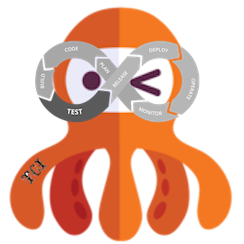

# TCI - Tikal Jenkins-based CI solution

### ***TCI - Tikal Jenkins-based CI solution***

We this repository, you can establish 2 kind of TCI Jenkins server types:
*  ***tci-master*** - for loading a well-established Jenkins server.
*  ***tci-local*** - for loading a local developement Jenkins environment.

